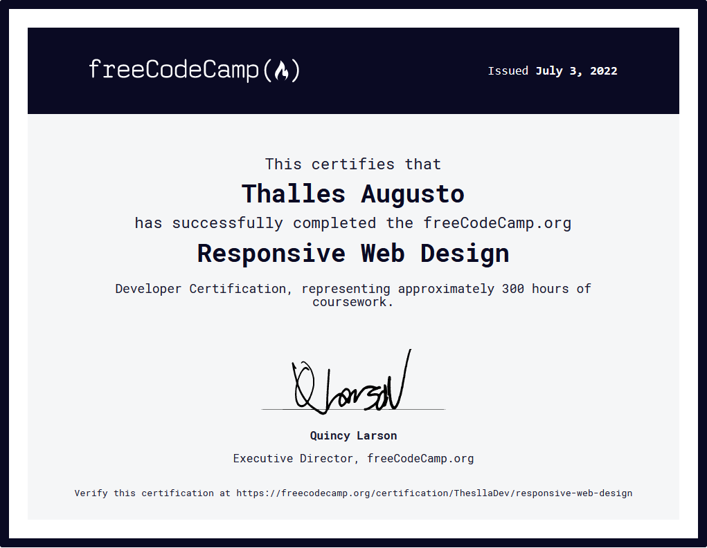
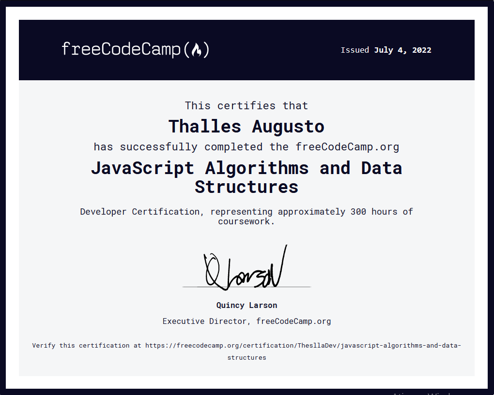

# Repositório para armazenar e compartilhar meus certificados

## Índice
* [Cisco](#cisco)
  * [Cybersecurity](#cybersecurity-cisco)
* [Digital Innovation One](#digital-innovation-one)
  * [Git](#git-dio)
  * [GitHub](#github-dio)
* [freeCodeCamp](#freeCodeCamp)
  * [Responsive Web Design](#responsive-web-design-freecodecamp)
  * [JavaScript Algorithms and Data Structures](#javascript-algorithms-and-data-structures)

---

### Cisco 

### Cybersecurity: 

---

### Digital Innovation One 

### GIT: 

### GitHub: 

---

### freeCodeCamp 

### Responsive Web Design: 

### JavaScript Algorithms and Data Structures: 

