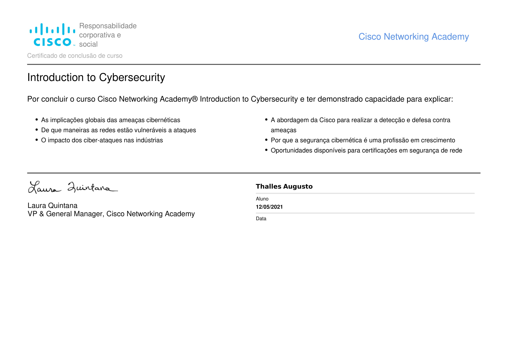
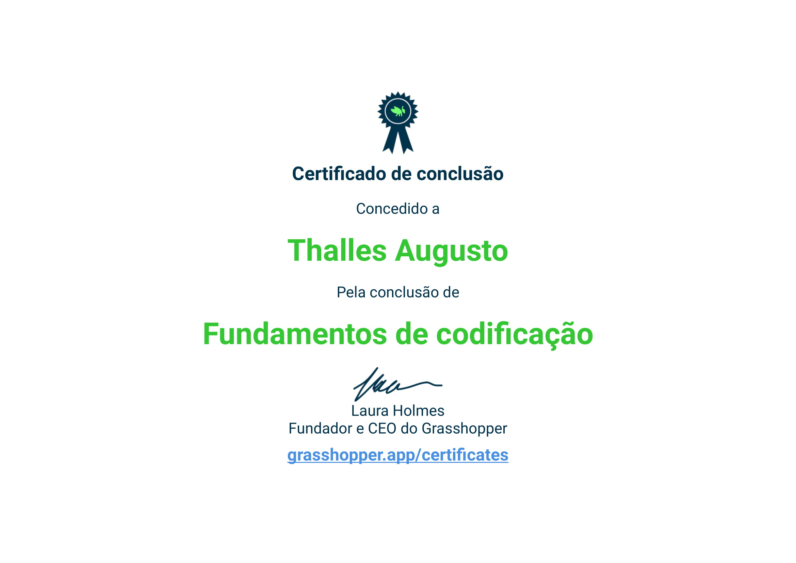
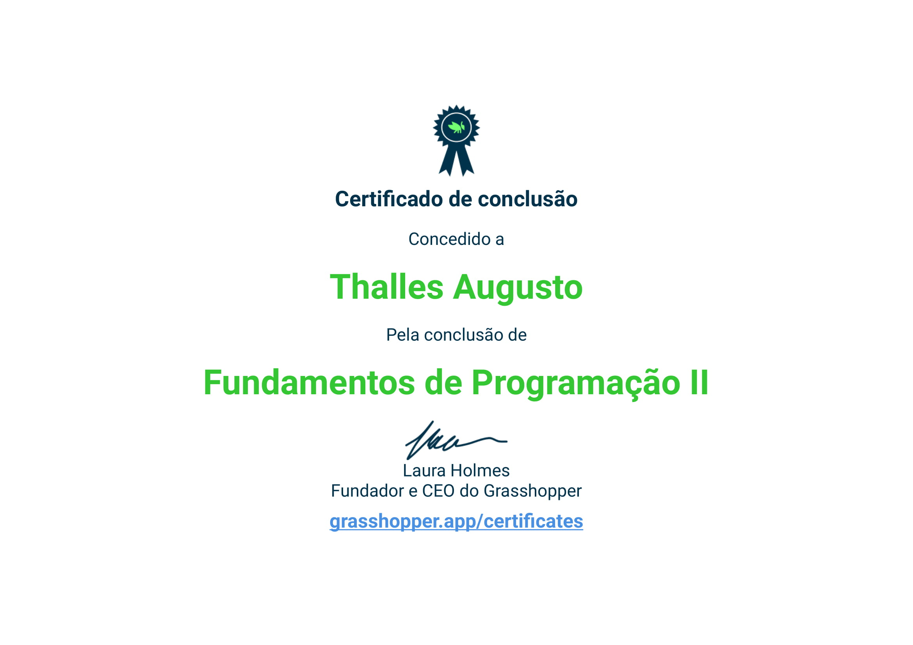
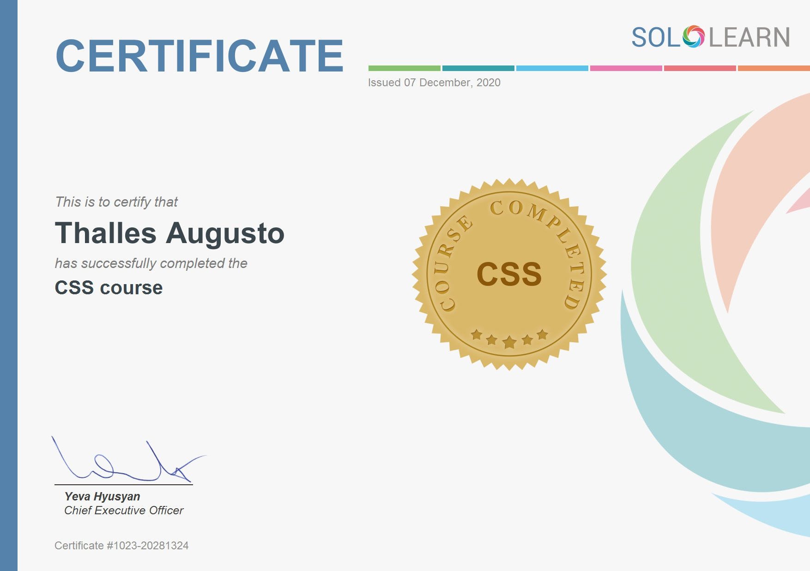
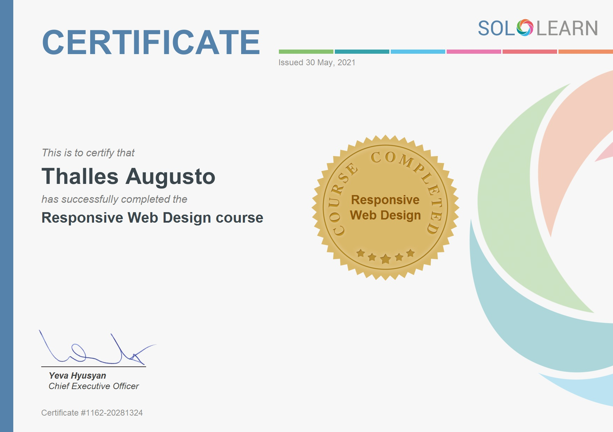

# Repositório para armazenar e compartilhar meus certificados

## Índice
* [Cisco](#cisco)
  * [Cybersecurity](#cybersecurity-cisco)
* [Digital Innovation One](#digital-innovation-one)
  * [Bootstrap](#bootstrap-dio)
  * [Git](#git-dio)
  * [GitHub](#github-dio)
  * [HTML5 e CSS3](#html5-e-css3-dio)
  * [JavaScript](#javascript-dio)
  * [Lógica de Programação](#logica-dio)
* [Grasshopper](#grasshopper)
  * [Fundamentos de Codificação](#fundamentos-de-codificacao)
  * [Fundamentos de Programação](#fundamentos-de-programacao)
* [SoloLearn](#sololearn)
  * [CSS](#css-sololearn)
  * [HTML](#html-sololearn)
  * [JavaScript](#javascript-sololearn)
  * [Responsive Web Design](#responsive-web-design-sololearn)
* [Udemy](#udemy)
  * [HTML](#html-udemy)

---

### Cisco 

### Cybersecurity: 

---

### Digital Innovation One 

### Bootstrap: 

### GIT: 

### GitHub: 

### HTML5 e CSS3: 

### JavaScript: 

### Lógica de Programação: 

---

### Grasshopper 

### Fundamentos de Codificação 

### Fundamentos de Programação 

---

### SoloLearn: 

### CSS: 

### HTML: 

### JavaScript: 

### Responsive Web Design: 

---

### Udemy

### HTML: 

